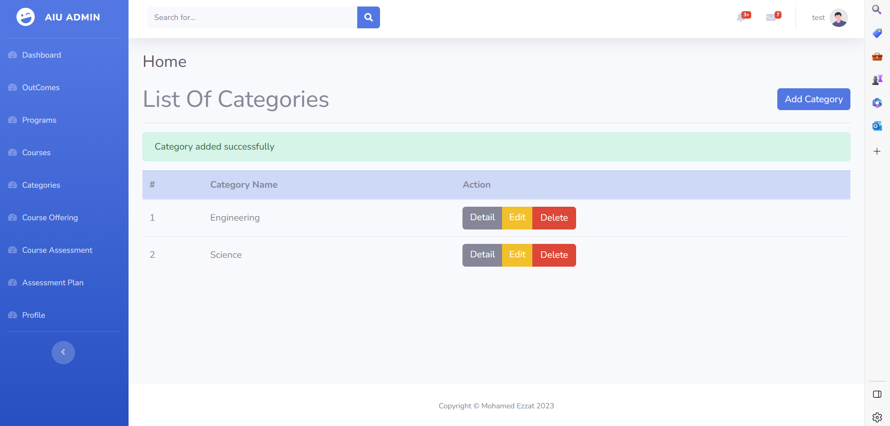

<p align="center">
<a href=""></a>
</p>

# <p align="center">ACADEMIC PROGRAM MANAGEMEN</p>

## Why APM ?

As part of Alamein International University's plan to improve its educational 
quality, the university is seeking ABET accreditation. To obtain 
accreditation, the university must meet certain standards, including having 
well-defined and measurable student learning outcomes.
This system will help the university manage its academic programs and track 
the progress of results towards meeting ABET standards.
The project provides the user to manage program and course categories, view 
the course and evaluate the course .


- [ABET organization](https://www.abet.org/).


## What APM ?

system will help the university manage its academic programs and track the progress.

1.	The system must allow the Dean to manage Outcomes by adding standard Outcome for each each program, update, and delete .
   
2.	The system must allow the Dean to manage Programs by adding program with select category to which the program belongs, update, and delete the program .
4.	The system must allow the Dean to manage Courses by adding course enter name, code of course with select program to which the program belongs, update, and delete the course .
5.	The system must allow the Dean to manage Categories by adding category, update, and delete the category.
6.	The system must allow the Dean to manage Courses offering by adding course enter year , select semster (Fall, Spring, Summer) with select course to which this belongs, update, and delete the course offering .
7.	The system must allow user to manage courses assessment by add the courses assessment the user enter outcome, Degree by P%, Degree by average based on select year semester ,course ,and program , filter the selected data based on year and semester and course and show this in table, and export filtered data 
selected in excel sheet automatically .
8.	The system must allow  user to manage assessment plan .


## How to run the system

Install Laravel Using Composer :
```
composer create-project laravel/laravel app-name
```
run project : 
```
php artisan serve
```

Configur Database :
```
php artisan migrate
```


## How the system work ?

#### Dashboard :

<p align="center">
<a href=""></a>
</p>

#### Manage Categories :
##### veiw Categies :

<p align="center">
<a href=""></a>
</p>

##### add Category :


## Contributing

Thank you for considering contributing to the Laravel framework! The contribution guide can be found in the [Laravel documentation](https://laravel.com/docs/contributions).

## Code of Conduct

In order to ensure that the Laravel community is welcoming to all, please review and abide by the [Code of Conduct](https://laravel.com/docs/contributions#code-of-conduct).

## Security Vulnerabilities

If you discover a security vulnerability within Laravel, please send an e-mail to Taylor Otwell via [taylor@laravel.com](mailto:taylor@laravel.com). All security vulnerabilities will be promptly addressed.

## License

The Laravel framework is open-sourced software licensed under the [MIT license](https://opensource.org/licenses/MIT).
